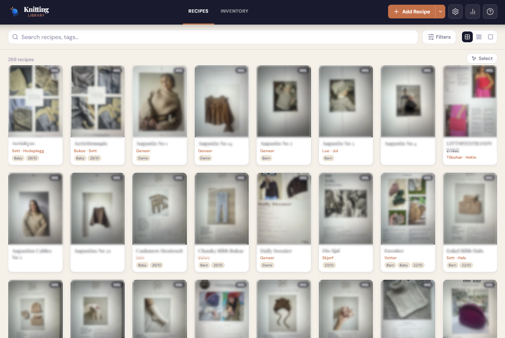
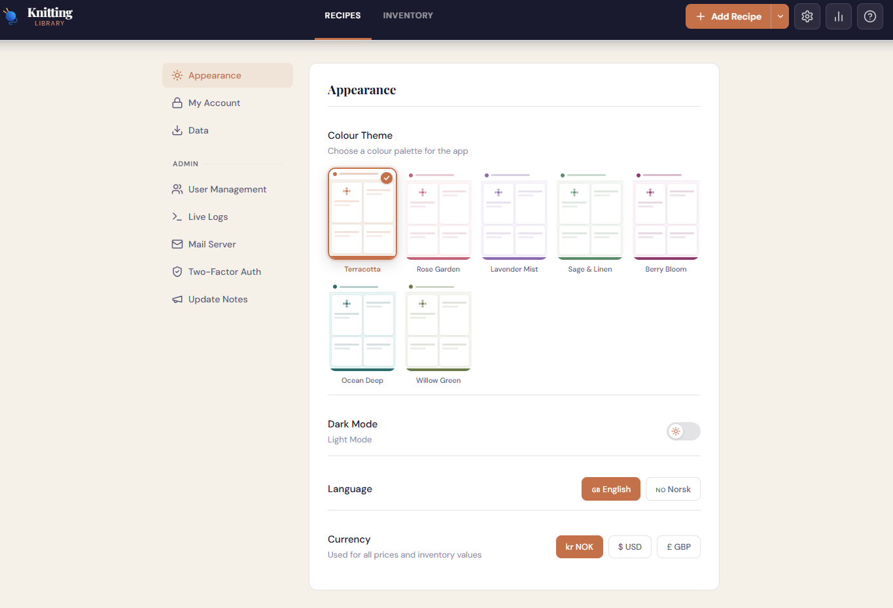
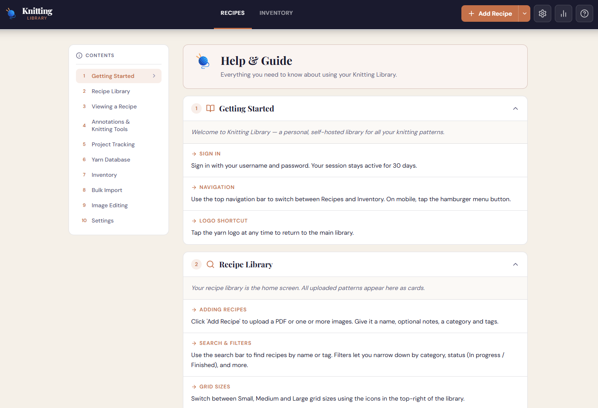
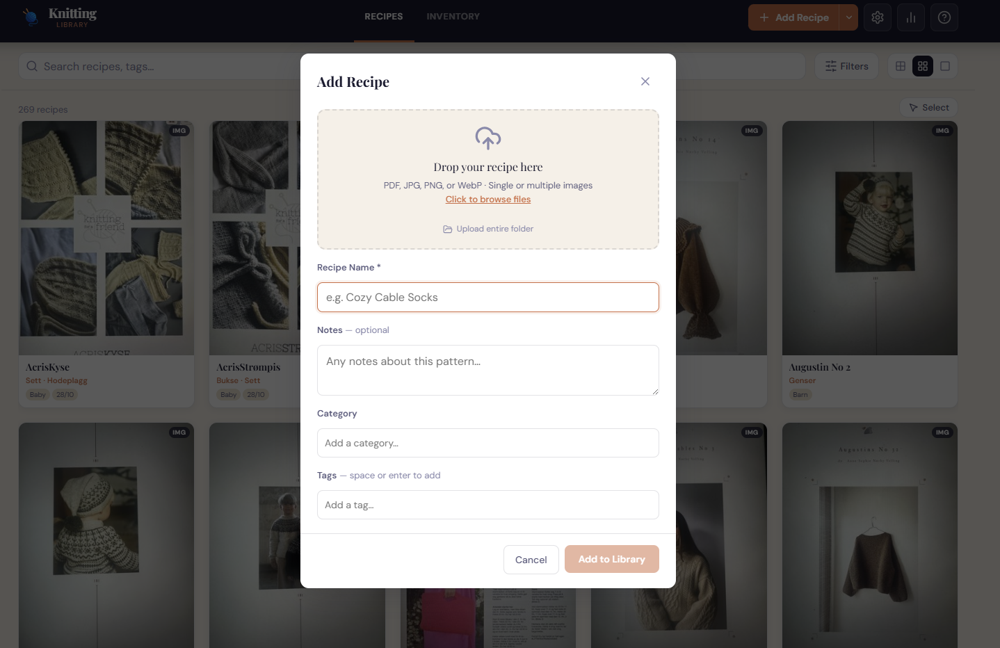

# Knitting Library

A self-hosted knitting pattern manager. Upload PDF patterns or scanned images, browse them in a searchable grid, annotate pages, track active projects, and manage a full yarn inventory — all from a single Docker container.

Built for personal use: my wife needed somewhere to store her knitting patterns without paying a subscription or giving her data to a third party.

> **Built with AI assistance.** This project was developed with Claude (Anthropic) as a coding assistant. The architecture, feature decisions, and direction are mine — the AI helped write and debug the code. The codebase has not been formally reviewed by a professional developer or security auditor, and you may encounter rough edges. See the [Security](#security) section for what has been implemented and what the limits are.

---
## Requirements

**Docker Desktop** — nothing else.
Download at: https://www.docker.com/products/docker-desktop/
Works on Windows, Mac, and Linux.

---

## Getting Started

**Terminal:**
```bash
docker-compose up -d
```
Then open `http://localhost:3000`.

**Docker Desktop GUI:**
Open the Compose section, point it at `docker-compose.yml`, and hit Start.

**Unraid / home server:**
```yaml
services:
  app:
    image: zeetlex/knitting-library:latest
    restart: unless-stopped
    ports:
      - "3000:8080"
    volumes:
      - /path/to/your/data:/data
      - /path/to/your/logs:/logs
```

**iPhone home screen:**
Open `http://YOUR-SERVER-IP:3000` in Safari → Share → Add to Home Screen.

---

## First Login

Default credentials: `admin` / `admin`
Change your password immediately — **Settings → My Account → Change Password**.

---

## Features

### Recipe Library
Visual grid with thumbnails and adjustable card size. Search by name or tag; filter by category, tag, or project status.

### Importing
Upload PDFs or images — single file, multiple images, or a whole folder. The **Bulk Import Wizard** lets you work through a folder one file at a time, adding metadata as you go, with automatic progress saving so you can stop and resume.

### Recipe Viewer
Scrollable pages with zoom and fullscreen. Swipe on mobile, arrow keys on desktop. **Custom cover image** — set any page or image as the recipe thumbnail.

### Annotations
Draw or highlight directly on any recipe page. Adjustable brush, opacity, and colour. Strokes are saved per-page to the database and persist across sessions.

### Project Tracking
Mark recipes as In Progress or Finished. Link a yarn and colour variant when starting, optionally deducting skeins from inventory. Full session history with timestamps. **Feedback** — rate finished projects on quality, difficulty, and result with optional notes; average score appears as a ★ badge on the card.

### Yarn Database
Catalogue yarn types with full specs: material, yardage, needle size, tension, seller, and price. Multiple colour variants per yarn, each with name, price, and photo. URL import to auto-fill fields *(early beta — works best with Sandnes Garn)*.

### Inventory
Track yarn skeins, needles, tools, and notions. Yarn entries link to the Yarn Database for specs. +/− buttons for quick quantity adjustments with a full history log per item.

### User Accounts
Username/password login with bcrypt hashing. Login rate limiting. Optional two-factor authentication (TOTP). Per-user settings: theme, colour theme, language (English/Norwegian), currency.

### Admin Panel
Create and manage user accounts, view live API logs, configure SMTP mail, and manage 2FA status for all users.

### Themes
Light and dark mode. Seven colour themes: Terracotta, Rose Garden, Lavender Mist, Sage & Linen, Berry Bloom, Ocean Deep, and Willow Green. Settings are per-user and saved to the database.

### Help & Guide
Built-in user guide accessible from the `?` icon in the header. Covers all features in ten accordion sections with a sticky table of contents. On desktop the TOC sits in a left sidebar; on mobile it collapses to a horizontally scrolling chip row. No login required to access the guide — it is available from any screen.

### Statistics
High-level metrics: recipe count, yarn entries, users, categories, tags, active and finished projects, inventory items, and total knitting sessions. Accessible from the statistics icon inside Settings.

### Backup & Export
Data lives in `./data/` — copy it to back up. Export as ZIP from **Settings → Data → Export Library**.

---

## Folder Structure

After first run, your directory will contain:

```
your-folder/
  docker-compose.yml
  data/
    knitting.db       <- database
    recipes/          <- recipe files and thumbnails
    yarns/            <- yarn images
  logs/
    uvicorn.log       <- all API requests and errors
    auth.log          <- failed logins (readable by fail2ban)
```

Logs rotate automatically (10 MB per file, 5 backups).

---

## Backups

Copy the `data/` folder — that is everything. The database, all recipe files, yarn images, annotations, session history, and settings are all in there.

To restore: copy `data/` back and restart the container.

---

## Security

The following measures are implemented:

| Area | Status |
|---|---|
| Password hashing | bcrypt (rounds=12) |
| Login rate limiting | 10 attempts per 15 min per IP, plus fail2ban support |
| Two-factor authentication | TOTP (Google Authenticator, Authy, etc.) |
| Session expiry | 30 days; 2FA challenges expire in 5 minutes |
| File upload validation | Magic-byte checks + size limits (50 MB PDF, 20 MB image) |
| CORS | Same-origin only (set `ALLOWED_ORIGINS` env var if needed) |
| Security headers | CSP, X-Frame-Options, Referrer-Policy, Permissions-Policy |
| API documentation | Disabled in production |
| SQL injection | Parameterised queries throughout |
| Path traversal | Filename sanitisation on all uploads |
| SSRF | Private IP blocking on yarn URL scraper |
| HTTPS | Not built in — use a reverse proxy |

**These measures were implemented in good faith but have not been reviewed by a security professional. You run this software at your own risk.**

Recommended deployment options, in order of preference:

- **Home network only** — safest, no external exposure
- **VPN access** (Tailscale, WireGuard) — safe for remote access
- **Reverse proxy with HTTPS** (Nginx Proxy Manager) — acceptable, see the Fail2ban section
- **Direct port forward to the internet** — not recommended

The author takes no responsibility for data loss, unauthorised access, or any issues arising from how you choose to deploy this application.

---

## Fail2ban (optional)

If you expose the app through a reverse proxy, fail2ban can block IPs that repeatedly fail to log in.

The app writes a dedicated auth log at `logs/auth.log`. Every failed login and bad 2FA code is recorded with the real client IP (extracted from `X-Forwarded-For`).

Example log line:
```
2025-01-15 14:23:45 AUTH_FAIL ip=1.2.3.4 user=admin reason=bad_password
```

**Filter** (`filter.d/knitting-library.conf`):
```ini
[Definition]
failregex = ^%Y-%m-%d %H:%M:%S AUTH_FAIL ip=<HOST>\b
ignoreregex =
datepattern = ^%%Y-%%m-%%d %%H:%%M:%%S
```

**Jail** (`jail.d/knitting-library.conf`):
```ini
[knitting-library]
enabled  = true
filter   = knitting-library
logpath  = /path/to/your/logs/auth.log
maxretry = 5
findtime = 600
bantime  = 3600
action   = iptables-multiport[name=knitting-library, port="80,443,3000", protocol=tcp]
```

Make sure Nginx Proxy Manager forwards the real client IP — add this to the **Advanced** tab of your proxy host:
```nginx
proxy_set_header X-Forwarded-For $proxy_add_x_forwarded_for;
proxy_set_header X-Real-IP $remote_addr;
```

Reload fail2ban after placing the files:
```bash
fail2ban-client reload
fail2ban-client status knitting-library
```

---

## Troubleshooting

| Problem | Fix |
|---|---|
| Blank page or won't load | Make sure Docker Desktop is running and the container is started |
| "Not logged in" error | Refresh the page — session may have expired after 30 days |
| PDF thumbnail not showing | PDF processing can be slow for large files — give it a moment |
| Can't reach it on phone | Use the server's IP, not `localhost`. Phone must be on the same Wi-Fi |
| Annotations not saving | Check that the `./data` volume is mounted correctly in your compose file |
| URL import didn't fill everything | Early beta — fill in missing fields manually |
| Live Logs shows nothing | Check that `./logs:/logs` is mounted in your compose file |
| All requests show same IP in logs | Set `X-Forwarded-For` in your reverse proxy (see Fail2ban section) |
| Port 8080 shows nothing | Check container logs: `docker logs knitting-library` |

---

## Status

This project is in active use but should be considered **beta software**. Things may change between versions. Keep backups of your `data/` folder before updating.

Open an issue if you find bugs or want to suggest something.


---
## Images
[](#images)
[](#images)
[](#images)
[](#images)
---

*Built with FastAPI · React · SQLite · Docker*
