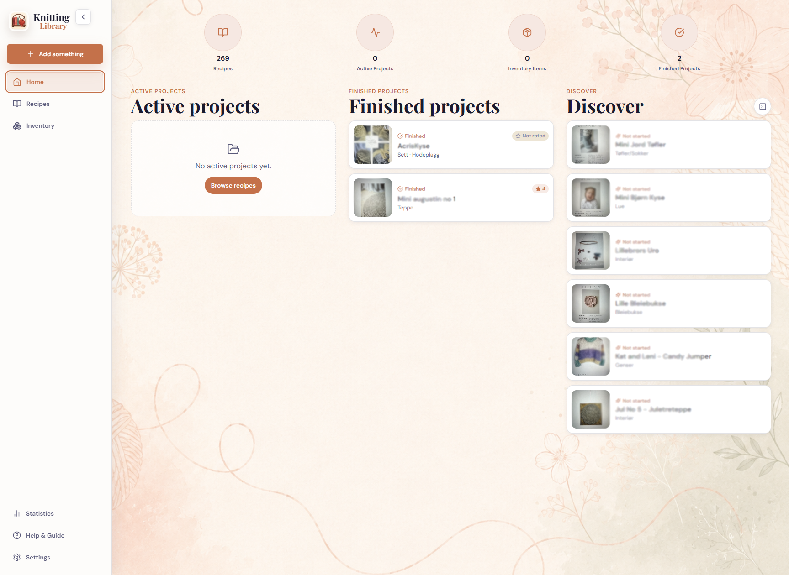
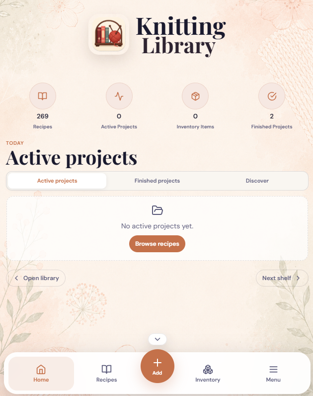
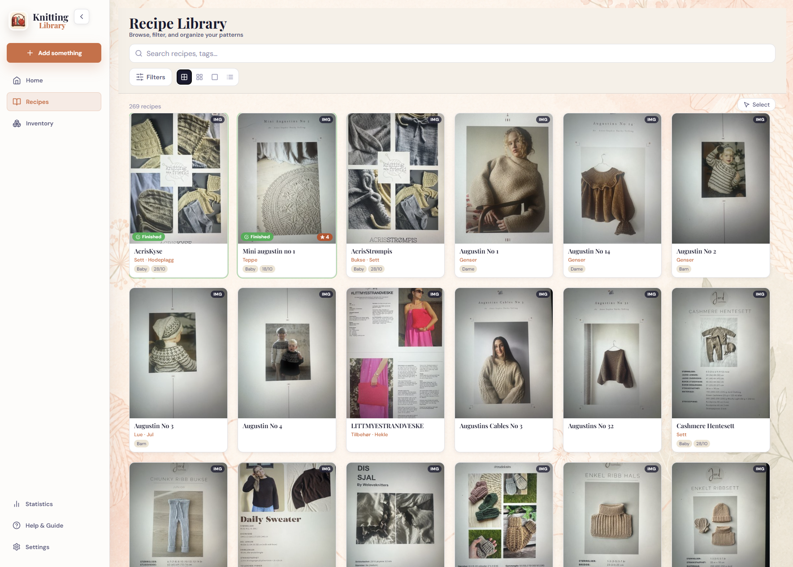
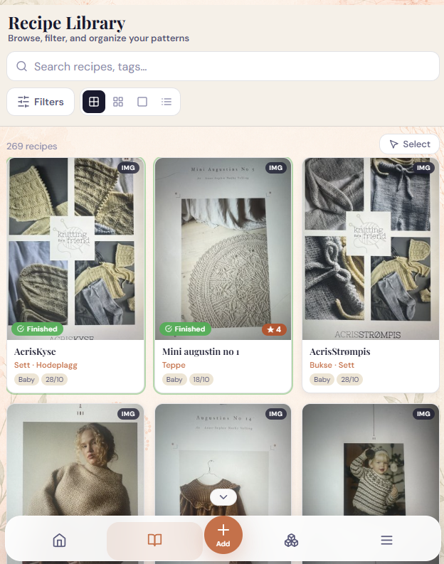
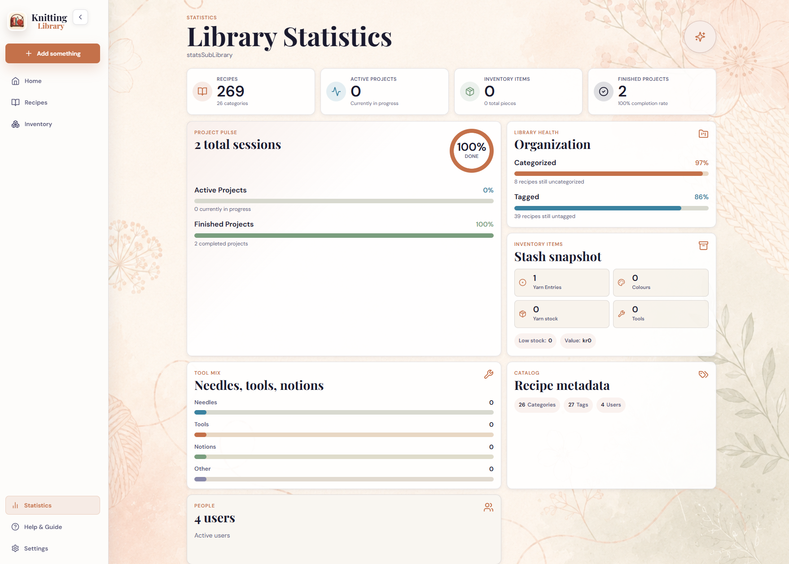
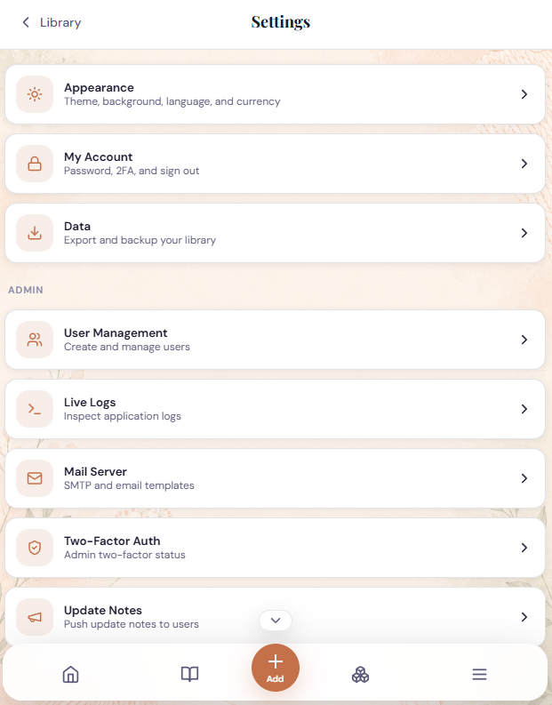
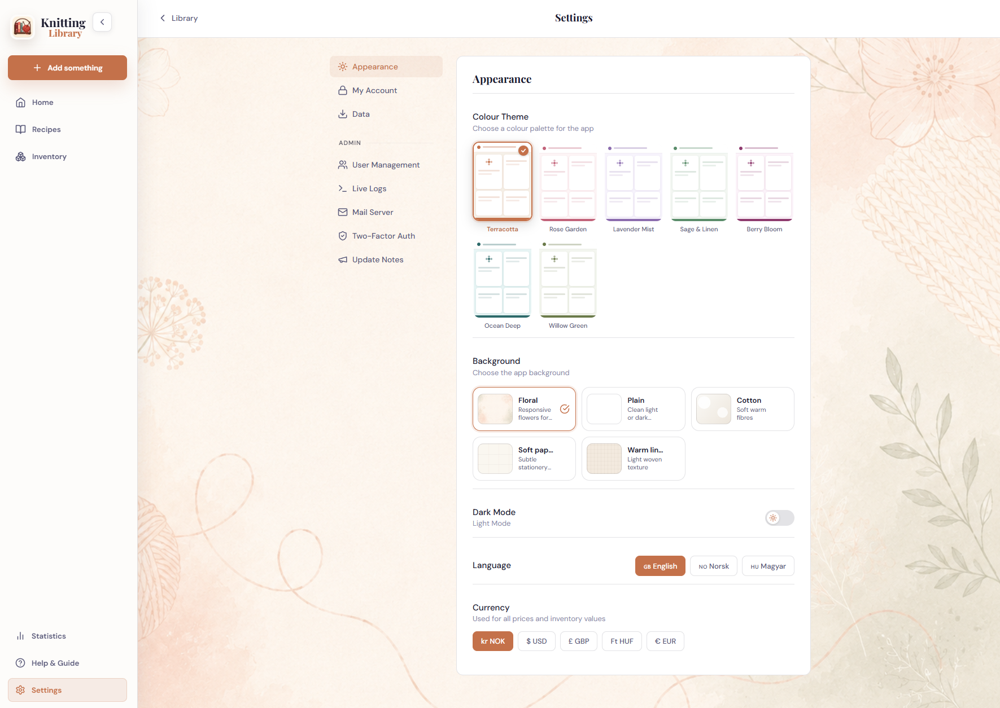

# Knitting Library

A self-hosted knitting pattern manager. Upload PDF patterns or scanned images, browse them in a searchable library, annotate pages, track active and finished projects, and manage a yarn database plus inventory from a single Docker container.

Built for personal use: my wife needed somewhere to store her knitting patterns without paying a subscription or giving her data to a third party.

> **Built with AI assistance.** This project was developed with AI coding assistants. The architecture, feature decisions, and direction are mine; AI helped write and debug code. The codebase has not been formally reviewed by a professional developer or security auditor, and you may encounter rough edges. See [Security](#security) for what has been implemented and what the limits are.

---

## Requirements

Docker Desktop, Docker Engine, or another Docker-compatible host.

Download Docker Desktop at: https://www.docker.com/products/docker-desktop/

---

## Getting Started

From the folder containing `docker-compose.yml`:

```bash
docker compose up -d
```

Then open `http://localhost:3000`.

On first launch, Knitting Library shows a setup screen where you create the first admin account. There are no default credentials.

Docker Desktop GUI:

Open the Compose section, point it at `docker-compose.yml`, and start the stack.

Unraid or home server example:

```yaml
services:
  app:
    image: zeetlex/knitting-library:latest
    restart: unless-stopped
    ports:
      - "3000:8080"
    environment:
      - PUID=99
      - PGID=100
      - TRUSTED_PROXIES=
    volumes:
      - /path/to/your/data:/data
      - /path/to/your/logs:/logs
```

iPhone home screen:

Open `http://YOUR-SERVER-IP:3000` in Safari, then use Share -> Add to Home Screen.

---

## First Login

Create your admin account in the first-run setup screen. Use a strong password; the first admin password must be at least 12 characters.

Existing installs are not changed. If your database already has users, the normal login screen appears.

---

## Interface

Knitting Library is designed primarily for mobile/PWA use while still supporting desktop browsers.

- **Home dashboard**: app logo, overview counters, active projects, finished projects, and a Discover shelf that favors unfinished or not-started recipes.
- **Mobile navigation**: bottom nav for Home, Recipes, Add, Inventory, and Menu. The nav can be collapsed into a small restore button when more screen space is needed.
- **Desktop navigation**: left sidebar with primary navigation and secondary links.
- **Add menu**: one Add button opens choices for adding recipes, importing folders, or adding yarn.
- **Unified Inventory**: Inventory contains yarn/thread samples, yarn stock, needles, tools, and notions in one place.
- **Settings**: mobile settings use section pages so Appearance, Account, Data, and admin tools do not become one long scrolling panel.

---

## Features

### Recipe Library

Visual grid with thumbnails and adjustable card size. Search by name or tag; filter by category, tag, or project status.

### Importing

Upload PDFs or images as a single file, multiple images, or a whole folder. The Bulk Import Wizard lets you work through a folder one file at a time, adding metadata as you go, with automatic progress saving so you can stop and resume.

### Recipe Viewer

Scrollable pages with zoom and fullscreen. Swipe on mobile, use arrow keys on desktop, and set any page or image as the recipe thumbnail.

Image recipes include editing tools for crop, rotate, reorder, cover selection, and persistent quality adjustment. Quality edits can tune brightness/exposure, contrast, gamma, saturation, warmth, and sharpness, with an original-image restore option.

### Text Version / Image To Text

Recipe pages can have a shared editable text version generated from scanned recipe images. Open a recipe, switch from **Original** to **Text version**, then create, edit, save, or regenerate the transcription.

> **Early beta:** the AI scan review and diagram tools are new, experimental, and expected to change a lot. The current UI for this feature is **not final**, especially the diagram editor and mobile layout. Treat AI output as a draft only.

Text recognition is configured by an admin under **Settings -> Admin -> AI / Text recognition**. The beta workflow uses a vision-capable OpenAI-compatible model and sends each recipe image or PDF page directly to AI for plain text transcription, then stores each page result beside the matching original image for review. An optional second AI cleanup step can then send the raw page text back to AI for Markdown cleanup before review. By default it can scan two pages at a time; set `AI_PAGE_SCAN_WORKERS` to tune that for your hardware. For knitting diagrams and legends, the current beta workflow is manual/user-guided: crop the diagram or legend from the original page and review it visually.

The app uses OpenAI-compatible chat completion endpoints, so it can work with:

- OpenAI GPT vision-capable models, for example `https://api.openai.com/v1` plus an API key
- Ollama, for example `http://host.docker.internal:11434/v1`
- LM Studio, for example `http://host.docker.internal:1234/v1`
- Other OpenAI-compatible local or hosted providers

The current beta workflow is user-guided instead of fully automatic:

- AI vision sends each page image directly to the model and marks the job as ready for review.
- Optional AI cleanup can format each page's raw scan before it reaches review.
- The Review view shows the original page beside the editable draft text.
- You can accept pages, pause and resume later, cancel the draft, insert a diagram crop, or crop a legend image.
- Completing review publishes one shared Markdown text version with reviewed text and any saved diagram/legend image inserts.

The diagram editor is an early beta crop overlay. It can move, resize, rotate, and size a grid over a diagram, but it does not yet parse knitting symbols into a final machine-readable chart. Legend crops are saved as images, not interpreted text.

Generated text is persistent for the whole server, not private per user. AI output should always be reviewed, especially for old scans, Norwegian/English knitting abbreviations, stitch counts, unclear page photos, and diagram symbols. Do not rely on generated instructions until a human has checked them against the original recipe.

### Annotations

Draw or highlight directly on recipe pages. Brush, opacity, and color are adjustable. Strokes are saved per page to the database and persist across sessions.

### Project Tracking

Mark recipes as active or finished. Link a yarn and color variant when starting, optionally deducting skeins from inventory. Finished projects can be rated for quality, difficulty, and result with optional notes.

### Yarn & Thread Inventory

Catalogue yarn types with material, yardage, needle size, tension, seller, price, and color variants. Each color can have a name, price, and photo. URL import is early beta and works best with Sandnes Garn.

### Inventory

Track yarn/thread samples, yarn stock, needles, tools, and notions. Yarn/thread entries can be saved with quantity 0 as project-planning samples, or with stock quantity for physical skeins. Quantity changes have quick controls and a history log.

### User Accounts

Username/password login with bcrypt hashing, login rate limiting, optional TOTP two-factor authentication, and per-user settings.

### Appearance

Light and dark mode. Seven color themes: Terracotta, Rose Garden, Lavender Mist, Sage & Linen, Berry Bloom, Ocean Deep, and Willow Green.

Background options are per-user and include Default, Plain, Cotton, Soft Paper, and Warm Linen. Generated backgrounds automatically adapt to light and dark mode.

### Languages And Currencies

The interface is available in English, Norwegian, and Hungarian. Prices and inventory values can be shown in NOK, USD, GBP, HUF, or EUR.

### Admin Panel

Create and manage user accounts, view API logs, configure SMTP mail, manage AI text recognition, manage 2FA status, and publish update notes.

### Help And Guide

Built-in user guide is available through the Menu. It covers core features in accordion sections and is available from inside the app.

### Statistics

High-level metrics: recipe count, yarn entries, users, categories, tags, active and finished projects, inventory items, and knitting sessions.

### Backup And Export

Data lives in `./data/`. Copy that folder to back up. You can also export from Settings -> Data -> Export Library.

---

## Folder Structure

After first run, your directory will contain:

```text
your-folder/
  docker-compose.yml
  data/
    knitting.db       <- database
    recipes/          <- recipe files and thumbnails
    yarns/            <- yarn images
  logs/
    uvicorn.log       <- API requests and errors
    auth.log          <- failed logins, useful for fail2ban
```

Logs rotate automatically: 10 MB per file, 5 backups.

---

## Backups

Copy the `data/` folder. That contains the database, recipe files, yarn images, annotations, session history, and settings.

To restore: copy `data/` back and restart the container.

Back up before updating, especially while the project is in beta.

---

## Security

The following measures are implemented:

| Area | Status |
|---|---|
| Password hashing | bcrypt, rounds=12 |
| Login rate limiting | 10 attempts per 15 min per IP, plus fail2ban support |
| Two-factor authentication | TOTP |
| Session expiry | 30 days; 2FA challenges expire in 5 minutes |
| Session storage | HttpOnly SameSite cookies; legacy `X-Session-Token` still accepted for compatibility |
| CSRF | CSRF token required for cookie-authenticated write requests |
| File upload validation | Magic-byte checks plus size limits: 50 MB PDF, 20 MB image |
| CORS | Same-origin only, set `ALLOWED_ORIGINS` if needed |
| Security headers | CSP, X-Frame-Options, Referrer-Policy, Permissions-Policy |
| API documentation | Disabled in production |
| SQL injection | Parameterised queries throughout |
| Path traversal | Filename sanitisation on uploads |
| SSRF | Yarn URL scraper validates DNS/IPs and redirect hops |
| Frontend dependencies | Vite build with committed npm lockfile |
| HTTPS | Not built in; use a reverse proxy |

These measures were implemented in good faith but have not been reviewed by a security professional. You run this software at your own risk.

Recommended deployment options, in order of preference:

- Home network only
- VPN access, such as Tailscale or WireGuard
- Reverse proxy with HTTPS
- Direct port forward to the internet is not recommended

The author takes no responsibility for data loss, unauthorised access, or issues arising from how you deploy this application.

---

## Reverse Proxy

If you run the app behind a reverse proxy, configure `TRUSTED_PROXIES` so the app only trusts `X-Forwarded-For` and `X-Forwarded-Proto` from your proxy. Use the proxy container IP or Docker network CIDR:

```yaml
environment:
  - TRUSTED_PROXIES=172.16.0.0/12
```

For Nginx Proxy Manager, add this in the proxy host Advanced tab:

```nginx
proxy_set_header X-Forwarded-For $proxy_add_x_forwarded_for;
proxy_set_header X-Forwarded-Proto $scheme;
proxy_set_header X-Real-IP $remote_addr;
```

For Caddy:

```caddyfile
knitting.example.com {
  reverse_proxy knitting-library:8080 {
    header_up X-Forwarded-For {remote_host}
    header_up X-Forwarded-Proto {scheme}
  }
}
```

Pin image versions for production when possible. `latest` is convenient for testing, but a version tag plus a backup before updating is safer.

---

## Fail2ban Optional Setup

If you expose the app through a reverse proxy, fail2ban can block IPs that repeatedly fail to log in.

The app writes failed login and bad 2FA attempts to `logs/auth.log`. When using a proxy, set `TRUSTED_PROXIES` as described above.

Example log line:

```text
2025-01-15 14:23:45 AUTH_FAIL ip=1.2.3.4 user=admin reason=bad_password
```

Filter, `filter.d/knitting-library.conf`:

```ini
[Definition]
failregex = ^%Y-%m-%d %H:%M:%S AUTH_FAIL ip=<HOST>\b
ignoreregex =
datepattern = ^%%Y-%%m-%%d %%H:%%M:%%S
```

Jail, `jail.d/knitting-library.conf`:

```ini
[knitting-library]
enabled  = true
filter   = knitting-library
logpath  = /path/to/your/logs/auth.log
maxretry = 5
findtime = 600
bantime  = 3600
action   = iptables-multiport[name=knitting-library, port="80,443,3000", protocol=tcp]
```

Reload fail2ban after placing the files:

```bash
fail2ban-client reload
fail2ban-client status knitting-library
```

---

## Troubleshooting

| Problem | Fix |
|---|---|
| Blank page or app will not load | Make sure Docker is running and the container is started |
| Not logged in error | Refresh the page; the session may have expired |
| PDF thumbnail not showing | Large PDFs can take time to process |
| Cannot reach it on phone | Use the server IP, not `localhost`, and make sure the phone is on the same network |
| Annotations not saving | Check that the `./data` volume is mounted correctly |
| URL import did not fill everything | URL import is early beta; fill missing fields manually |
| Live logs show nothing | Check that `./logs:/logs` is mounted |
| Requests show the same IP | Configure forwarded headers and `TRUSTED_PROXIES` |
| Port 8080 shows nothing | Check container logs with `docker logs knitting-library` |

---

## Status

This project is in active use but should be considered beta software. Things may change between versions. Keep backups of your `data/` folder before updating.

Open an issue if you find bugs or want to suggest something.

---

## Screenshots

Desktop and mobile views of the current interface:

| Desktop | Mobile |
|---|---|
|  |  |
|  |  |
|  |  |



---

Built with FastAPI, React, Vite, SQLite, and Docker.
