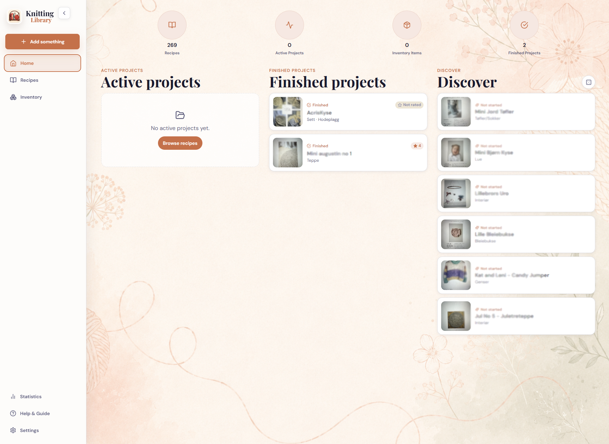
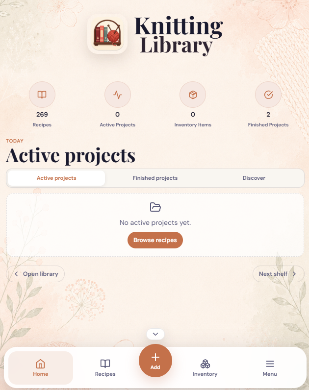
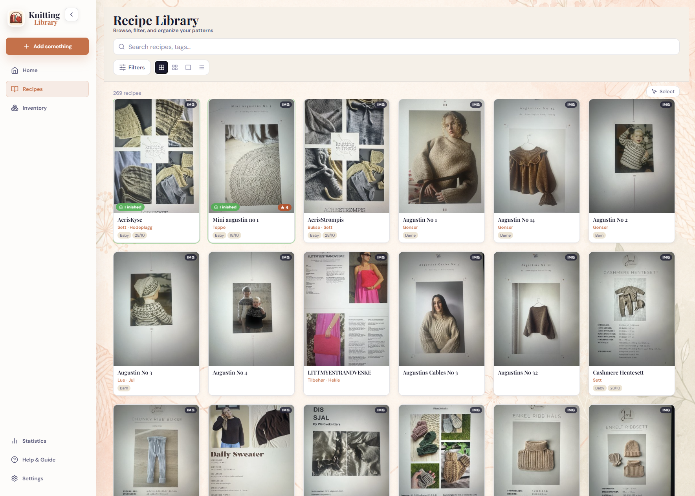
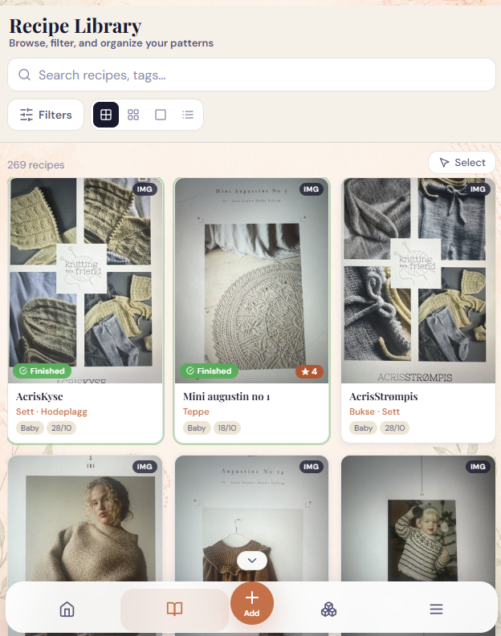
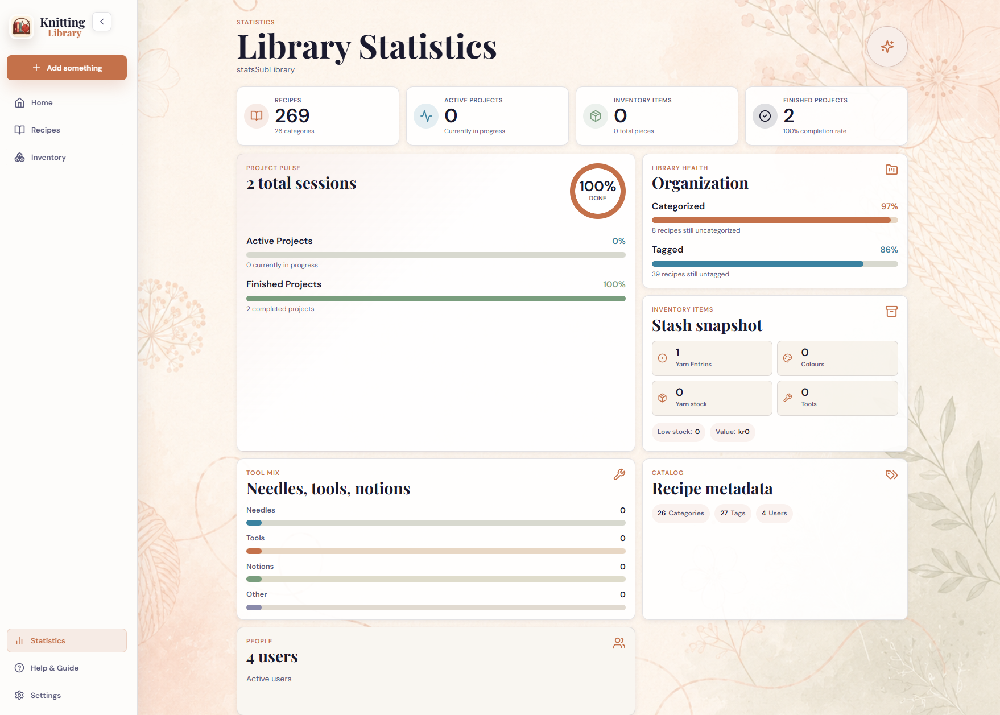
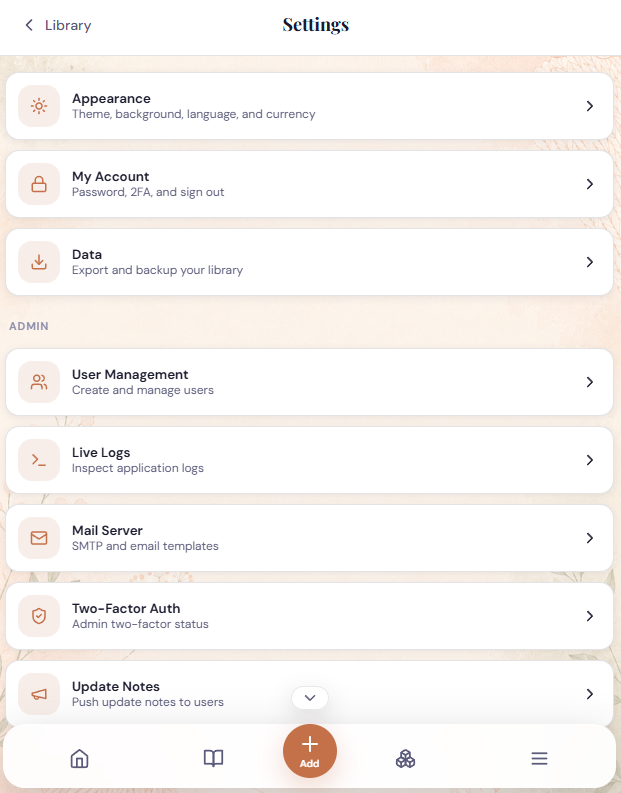
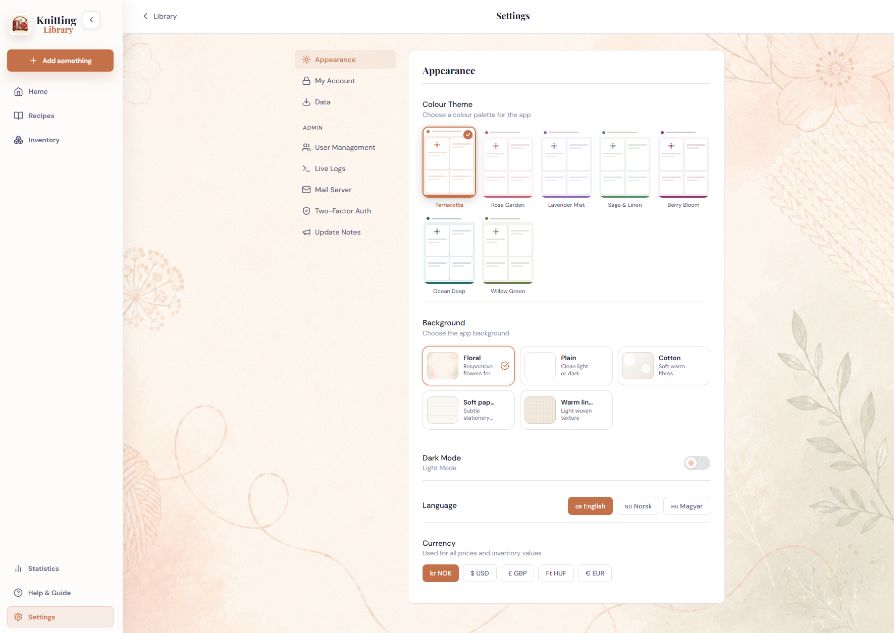

# Knitting Library

Knitting Library is a self-hosted pattern, project, and yarn inventory manager for people who want their knitting archive under their own control. It runs in a single Docker container or directly as a Python service, stores data locally, and provides a mobile-friendly interface for daily use.

The project started as a practical home tool: a private place to keep knitting patterns, notes, project status, and yarn inventory without a subscription or third-party data lock-in.

> **Built with AI assistance.** This project was developed with AI coding assistants. Architecture, feature decisions, and direction remain human-owned; AI helped write and debug code. The codebase has not been formally reviewed by a professional developer or security auditor. See [Security](#security) for the current posture and limits.

## What It Does

- Stores PDF patterns and scanned image recipes with generated thumbnails.
- Provides searchable recipe browsing, categories, tags, and project status filters.
- Supports page annotations, recipe text versions, image cleanup tools, and per-recipe knitting tools for counters, increase/decrease calculations, and notes.
- Tracks active and finished projects per user, with shared household visibility.
- Manages yarn and thread references, color variants, stock, needles, tools, and notions.
- Includes user accounts, optional TOTP two-factor authentication, per-user appearance settings, and admin tools.
- Offers the interface in English, Norwegian, Hungarian, French, German, and Spanish.
- Runs locally with SQLite-backed storage in configurable data and log directories.

## Status

Knitting Library is active beta software. It is used in real workflows, but interfaces and data workflows may still change. Keep regular backups of the `data/` folder, especially before updating.

AI-assisted text recognition and diagram review are early beta features. Treat generated text as a draft and check it against the original pattern before relying on it.

## Quick Start

Requirements: Docker Desktop, Docker Engine, or another Docker-compatible host.

From the folder containing `docker-compose.yml`:

```bash
docker compose up -d
```

Open `http://localhost:3000` and create the first admin account. There are no default credentials.

For Unraid, reverse proxy, fail2ban, backups, AI setup, and troubleshooting, see the [deployment and operations guide](GUIDE.md).

## Storage

Runtime data is kept separately from the application. The default Docker bind mounts use this layout:

```text
data/
  recipes.db
  recipes/
  yarns/
  branding/
logs/
  uvicorn.log
  supervisord.log
  auth.log
```

Backups are straightforward: stop the container if possible, copy `data/`, then restart. Restoring means putting `data/` back and starting the container again.

## Running without Docker

The backend can run directly as an unprivileged service, including when packaged for YunoHost. It serves both the API and the built frontend. Use Python 3.12, Node.js 20.19+ (or a compatible newer release) to build the frontend, and Poppler (`poppler-utils` on Debian/Ubuntu) for PDF processing. Node.js is only needed during the build. This does not include a YunoHost package, YunoHost SSO, or hosting under a URL subpath; serve the app at the root of its own hostname.

From the repository root, create a virtual environment and build the frontend:

```bash
python3.12 -m venv .venv
.venv/bin/python -m pip install -r app/backend/requirements.txt
cd app/frontend
npm ci --legacy-peer-deps
npm run build
cd ../..
```

The build is written to `app/frontend/dist`. Configure these paths before starting the backend:

| Environment variable | Default | Contents |
|---|---|---|
| `KNITTING_DATA_DIR` | `/data` | `recipes.db`, `recipes/`, `yarns/`, `branding/` |
| `KNITTING_LOG_DIR` | `/logs` | `auth.log` and files read by Admin Logs |
| `KNITTING_STATIC_DIR` | `/app/frontend/build` | Built frontend, including `index.html` |

Unset or blank values use the defaults. Explicit paths must be absolute. The backend does not automatically load `.env`; export the values or supply them through your service manager. Restart the service after changing them. Data paths must be writable by the service account, and frontend files must be readable. Do not grant the service write access to the source code or frontend assets unless needed by your packaging workflow.

For example, with the repository at `/opt/knitting-library` and writable directories already created for your service account:

```bash
export KNITTING_DATA_DIR=/var/lib/knitting-library
export KNITTING_LOG_DIR=/var/log/knitting-library
export KNITTING_STATIC_DIR=/opt/knitting-library/app/frontend/dist
cd /opt/knitting-library/app/backend
/opt/knitting-library/.venv/bin/uvicorn main:app --host 127.0.0.1 --port 8080 --access-log \
  >> /var/log/knitting-library/uvicorn.log 2>&1
```

Open the app through your reverse proxy and create the first admin account. Set `TRUSTED_PROXIES` to the proxy addresses/CIDRs when using forwarded HTTPS/client-IP headers; for a proxy on the same machine, `127.0.0.1/32,::1/128` is appropriate. See [the reverse proxy guide](GUIDE.md#reverse-proxy). `ALLOWED_ORIGINS` is only needed when frontend and API origins differ. HTTPS is handled by the reverse proxy.

### systemd example

Create a dedicated `knitting-library` service account and provision `/var/lib/knitting-library` and `/var/log/knitting-library` with that account as owner (for example, mode `0750`). Install this unit as `/etc/systemd/system/knitting-library.service`, adjusting installation paths as needed:

```ini
[Unit]
Description=Knitting Library
After=network.target

[Service]
Type=simple
User=knitting-library
Group=knitting-library
WorkingDirectory=/opt/knitting-library/app/backend
Environment=KNITTING_DATA_DIR=/var/lib/knitting-library
Environment=KNITTING_LOG_DIR=/var/log/knitting-library
Environment=KNITTING_STATIC_DIR=/opt/knitting-library/app/frontend/dist
Environment=TRUSTED_PROXIES=127.0.0.1/32,::1/128
ExecStart=/opt/knitting-library/.venv/bin/uvicorn main:app --host 127.0.0.1 --port 8080 --access-log
StandardOutput=append:/var/log/knitting-library/uvicorn.log
StandardError=append:/var/log/knitting-library/uvicorn.log
Restart=on-failure
UMask=0027

[Install]
WantedBy=multi-user.target
```

Run `sudo systemctl daemon-reload` and `sudo systemctl enable --now knitting-library`. The `append:` output destination requires systemd 240 or newer. Arrange log rotation through the host's logging tools. The Docker entrypoint is not used by this service.

`KNITTING_LOG_DIR` selects authentication logging and Admin Logs file locations; it does not redirect Uvicorn output. Configure your service manager as above for Admin Logs to show server output. Native deployments do not produce the Docker entrypoint's `supervisord.log`; that source may remain absent. If file-based authentication logging is unavailable, authentication events fall back to stderr.

For password recovery, use the same `KNITTING_DATA_DIR` as the service and run from the backend directory:

```bash
sudo -u knitting-library env KNITTING_DATA_DIR=/var/lib/knitting-library \
  /opt/knitting-library/.venv/bin/python -m app.cli reset-password admin
```

### Moving existing data and custom Docker paths

Changing `KNITTING_DATA_DIR` does not move data. Stop the service, back up the complete existing data directory, then copy or move `recipes.db`, `recipes/`, `yarns/`, `branding/`, and any SQLite sidecar files together to the new root. Set ownership for the service account, update the environment, restart, and verify users, recipes, yarn images, custom icons, and exports before removing the old copy. A wrong or empty destination can initialize a new database and make the existing library appear missing.

Existing Docker deployments need no configuration changes. The variables select paths **inside** the container. If overriding data or log paths in `.env`, update the Compose volume targets to match; for example, `KNITTING_DATA_DIR=/storage` requires `./data:/storage` instead of `./data:/data`. A custom static directory must contain the built frontend and be copied or mounted into the container. Changing only the host side of an existing bind mount does not require these variables.

## Recover a User Password

If a user cannot sign in and email recovery is unavailable, an operator with access to the Docker host can reset the password interactively:

```bash
docker exec -it knitting-library python -m app.cli reset-password admin
```

Replace `admin` with the exact username. The command prompts for the new password twice, requires at least 8 characters, and does not put the password in the command or shell history. A successful reset signs out that user's existing sessions. If the Compose service has a different container name, use that name in place of `knitting-library` (find it with `docker compose ps`).

## Security

Implemented measures include bcrypt password hashing, login rate limiting, optional TOTP two-factor authentication, HttpOnly SameSite session cookies, CSRF protection for cookie-authenticated writes, upload validation, same-origin CORS by default, security headers, disabled production API docs, parameterised database queries, upload filename sanitisation, and SSRF checks for yarn URL imports.

HTTPS is not built into the container. Use a reverse proxy if the app is reachable beyond a trusted private network. A home network or VPN-only deployment is strongly preferred; direct public port forwarding is not recommended.

These measures were implemented in good faith, but the project has not had a professional security audit. You run this software at your own risk.

## Screenshots

| Desktop | Mobile |
|---|---|
|  |  |
|  |  |
|  |  |



## Documentation

- [Deployment and operations guide](GUIDE.md)
- [Changelog](CHANGELOG.md)
- [Code of conduct](CODE_OF_CONDUCT.md)

## Tech Stack

FastAPI, React, Vite, SQLite, and Docker.
